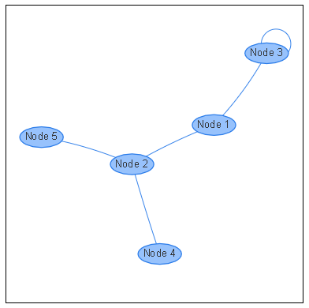

# JavaScript libraries for graphs

After trying several libraries, discarding those that were not open source and others that did not work correctly, we have finally been left with two options, **Vis Network** and **SigmaJS**, of which we finished choosing **Vis Network**.

The reason why *SigmaJS* was discarded is because its latest stable version is 1.2.1 and it has not been updated for three years. They are currently working on version 2.0.0, but this version is in alpha and was released just two months ago.

On the other hand, *Vis Network* is a library that is updated more often, whose stable version is much more recent (this year).

# Vis Network

Vis Network is a JavaScript library designed to display dynamic, customizable and automatically organised graphs.

## Using Vis Network

It is not necessary to download the library itself as it can be referenced through the following link:

> https://unpkg.com/vis-network/standalone/umd/vis-network.min.js

But you also have the option to download and use it via NPM. With the following link you can go to the library itself where it is explained how to install it in this way:

> https://github.com/visjs/vis-network

## Example

To run the example simply go to *vis_js* folder and make **npm install** and **npm run run**.