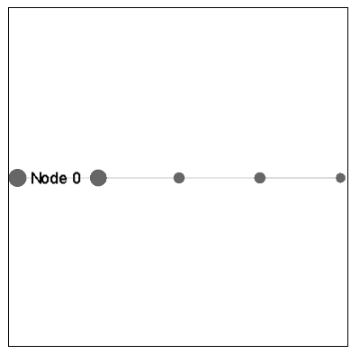

# Librerías JS para grafos

Después de probar varias librerías, descartando aquellas que no eran open source y otras que no funcionaban de forma correcta, finalmente nos hemos quedado con dos opciones: vis.js y sigma.js. 

# Vis.js

Vis.js es una biblioteca realmente cómoda y fácil de usar, diseñada para manejar grandes cantidades de datos dinámicos y permitir la manipulación e interacción con estos. La biblioteca consta de los componentes *DataSet*, *Timeline*, *Network*, *Graph2d* y *Graph3d*. 

## Usando vis.js

A la hora de utilizar **vis.js** no es necesario descargarse la librería en sí ya que se puede referenciar mediante el siguiente enlace:

> https://unpkg.com/vis-network/standalone/umd/vis-network.min.js

Igualmente dejo el enlace a la librería donde se explica cómo instalarla:

> https://github.com/visjs/vis-network

## Ejemplo

# Sigma.js

Sigma.js es una librería de JavaScript enfocada en el diseño de gráficos.

## Usando sigma.js

Para utilizar **sigma.js** es necesario tener descargado su código fuente (o por lo menos la carpeta src), el cual podemos obtener del siguiente enlace:

> https://github.com/jacomyal/sigma.js

Nosotros subido sólo tenemos los *src* en:

> /sigma_js/js/library/src

Una vez hecho esto simplemente habrá que referenciar los archivos pertinentes en nuestro index.html y ya podremos hacer uso de todas las funciones de **Sigma**.

## Ejemplo

